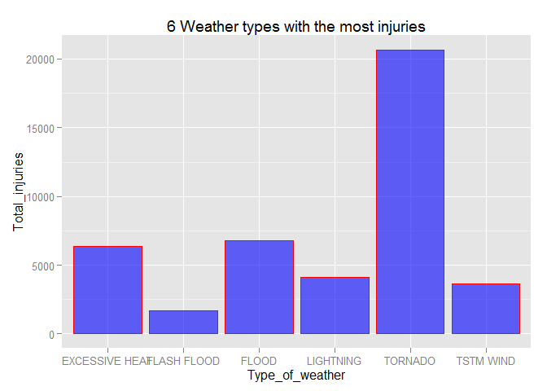
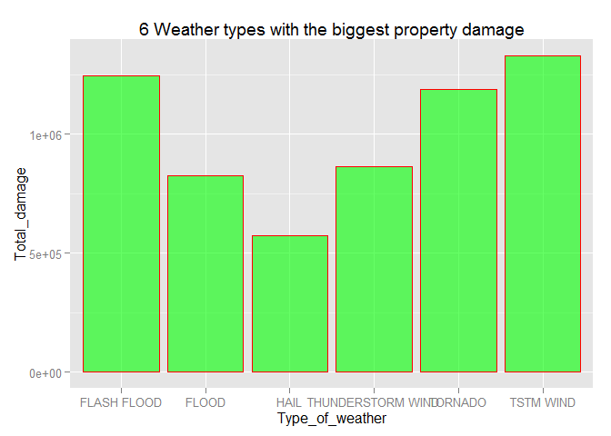
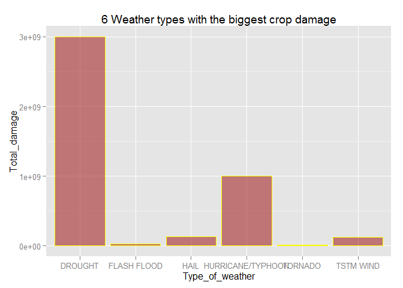

# Analysis of Weather Data from USA
Stefan Kosztolanyi  
Created on 25th of September, 2015  
##Synopsis
This report is created using Rstuio, knitr and ggplot2 packages in a R markdown file.
In this analysis I answer various questions about a dataset and make plots to visualise the answers.
The dataset as well as questions are provided by Coursera's course Reproducible Research, which is part of a Data Science Specialization by John Hopkins University.

The Dataset comes in the form of a comma-separated-value file compressed via the bzip2 algorithm to reduce its size. You can download the file from the course web site:
https://d396qusza40orc.cloudfront.net/repdata%2Fdata%2FStormData.csv.bz2

There is also some documentation of the database available. Here you will find how some of the variables are constructed/defined.

https://d396qusza40orc.cloudfront.net/repdata%2Fpeer2_doc%2Fpd01016005curr.pdf

https://d396qusza40orc.cloudfront.net/repdata%2Fpeer2_doc%2FNCDC%20Storm%20Events-FAQ%20Page.pdf

The events in the database start in the year 1950 and end in November 2011. In the earlier years of the database there are generally fewer events recorded, most likely due to a lack of good records. More recent years should be considered more complete.

## Preparing the environment

I will be showing all the code and plots in this document openly, therefore I want to set echo=TRUE value for the whole document:

```r
library(knitr)
```

```
## Warning: package 'knitr' was built under R version 3.2.2
```

```r
require("knitr")
opts_chunk$set(echo=TRUE, results="asis")
```

I will be making the plots in ggplot2, so I can load the package:

```r
library(ggplot2)
```

##Loading and Processing the Raw Data
I set working directory to the one where I donwloaded the file

```r
setwd("C:/Users/stefan/Google Drive OldZZZ/Coursera/Data Science/Reproducible research")
```

I then manually extract the zip file with winrar software in the working folder

With this command I read the whole csv file into r and call the dataset "storm0"
(The file is quite big, so it takes time to load it.)

```r
storm0 = read.csv("repdata-data-StormData.csv")
str(storm0)
```

'data.frame':	902297 obs. of  37 variables:
 $ STATE__   : num  1 1 1 1 1 1 1 1 1 1 ...
 $ BGN_DATE  : Factor w/ 16335 levels "1/1/1966 0:00:00",..: 6523 6523 4242 11116 2224 2224 2260 383 3980 3980 ...
 $ BGN_TIME  : Factor w/ 3608 levels "00:00:00 AM",..: 272 287 2705 1683 2584 3186 242 1683 3186 3186 ...
 $ TIME_ZONE : Factor w/ 22 levels "ADT","AKS","AST",..: 7 7 7 7 7 7 7 7 7 7 ...
 $ COUNTY    : num  97 3 57 89 43 77 9 123 125 57 ...
 $ COUNTYNAME: Factor w/ 29601 levels "","5NM E OF MACKINAC BRIDGE TO PRESQUE ISLE LT MI",..: 13513 1873 4530 10592 4304 10094 1973 23873 24418 4530 ...
 $ STATE     : Factor w/ 72 levels "AK","AL","AM",..: 2 2 2 2 2 2 2 2 2 2 ...
 $ EVTYPE    : Factor w/ 985 levels "   HIGH SURF ADVISORY",..: 834 834 834 834 834 834 834 834 834 834 ...
 $ BGN_RANGE : num  0 0 0 0 0 0 0 0 0 0 ...
 $ BGN_AZI   : Factor w/ 35 levels "","  N"," NW",..: 1 1 1 1 1 1 1 1 1 1 ...
 $ BGN_LOCATI: Factor w/ 54429 levels "","- 1 N Albion",..: 1 1 1 1 1 1 1 1 1 1 ...
 $ END_DATE  : Factor w/ 6663 levels "","1/1/1993 0:00:00",..: 1 1 1 1 1 1 1 1 1 1 ...
 $ END_TIME  : Factor w/ 3647 levels ""," 0900CST",..: 1 1 1 1 1 1 1 1 1 1 ...
 $ COUNTY_END: num  0 0 0 0 0 0 0 0 0 0 ...
 $ COUNTYENDN: logi  NA NA NA NA NA NA ...
 $ END_RANGE : num  0 0 0 0 0 0 0 0 0 0 ...
 $ END_AZI   : Factor w/ 24 levels "","E","ENE","ESE",..: 1 1 1 1 1 1 1 1 1 1 ...
 $ END_LOCATI: Factor w/ 34506 levels "","- .5 NNW",..: 1 1 1 1 1 1 1 1 1 1 ...
 $ LENGTH    : num  14 2 0.1 0 0 1.5 1.5 0 3.3 2.3 ...
 $ WIDTH     : num  100 150 123 100 150 177 33 33 100 100 ...
 $ F         : int  3 2 2 2 2 2 2 1 3 3 ...
 $ MAG       : num  0 0 0 0 0 0 0 0 0 0 ...
 $ FATALITIES: num  0 0 0 0 0 0 0 0 1 0 ...
 $ INJURIES  : num  15 0 2 2 2 6 1 0 14 0 ...
 $ PROPDMG   : num  25 2.5 25 2.5 2.5 2.5 2.5 2.5 25 25 ...
 $ PROPDMGEXP: Factor w/ 19 levels "","-","?","+",..: 17 17 17 17 17 17 17 17 17 17 ...
 $ CROPDMG   : num  0 0 0 0 0 0 0 0 0 0 ...
 $ CROPDMGEXP: Factor w/ 9 levels "","?","0","2",..: 1 1 1 1 1 1 1 1 1 1 ...
 $ WFO       : Factor w/ 542 levels ""," CI","$AC",..: 1 1 1 1 1 1 1 1 1 1 ...
 $ STATEOFFIC: Factor w/ 250 levels "","ALABAMA, Central",..: 1 1 1 1 1 1 1 1 1 1 ...
 $ ZONENAMES : Factor w/ 25112 levels "","                                                                                                                               "| __truncated__,..: 1 1 1 1 1 1 1 1 1 1 ...
 $ LATITUDE  : num  3040 3042 3340 3458 3412 ...
 $ LONGITUDE : num  8812 8755 8742 8626 8642 ...
 $ LATITUDE_E: num  3051 0 0 0 0 ...
 $ LONGITUDE_: num  8806 0 0 0 0 ...
 $ REMARKS   : Factor w/ 436774 levels "","-2 at Deer Park\n",..: 1 1 1 1 1 1 1 1 1 1 ...
 $ REFNUM    : num  1 2 3 4 5 6 7 8 9 10 ...

We can see, that there are 902297 observations of 37 variables. Just to remind you, the dataset spans from the year 1950 to year 2011, so 61 years in total. That should be enough, to firmly ground our analysis in this dataset.

I want to create a new column, that will only contain years instead of the whole date.
I will use BGN_DATE column for this conversion:


```r
storm0$YEAR <- as.numeric(format(as.Date(storm0$BGN_DATE, format = "%m/%d/%Y %H:%M:%S"), "%Y"))
```

I will create a new dataset now, that uses only data from the last 15 years. The years before are mostly incomplete, while the last 15 years are well documented.

```r
stormex<- storm0[storm0$YEAR>1995, ]
```


##The Target
This dataset is big and we could analyze it for many hours, even days. But for our current purpose, we want to answer only a few specific questions. We are interested in the connection of various weathers types to public health and consequences of weather to economy.
This is how we formulate our questions:

1. Across the United States, which types of events (as indicated in the EVTYPE variable) are most harmful with respect to population health?

2. Across the United States, which types of events have the greatest economic consequences?

We will be interested in these columns from the dataset:
EVTYPE, BGN_DATE, FATALITIES, INJURIES, PROPDMG, CROPDMG

The Propdmg and cropdmg don't have the correct values, because they need to be multiplied by propdmgexp and cropdmgexp respectively, where h= hundred, k = thousand dollars, m = million and b = billion.
I create a multiplier and then change the cropdmg column values:

```r
multiplier <- c('K' = 1000, "k" = 1000, "m" = 1000, 'M' = 1000000, "B" = 1000000000, "h"=100, "H"=100, "2"=0, " "=0)
stormex$CROPDMG <- multiplier[stormex$CROPDMGEXP]
```

From now on, I want to work with only smaller dataframe, that has only these columns I need in it:

```r
small<-data.frame(stormex$EVTYPE, stormex$FATALITIES, stormex$INJURIES, stormex$PROPDMG, stormex$PROPDMGEXP, stormex$CROPDMG, stormex$CROPDMGEXP, stringsAsFactors = FALSE)
```

I could use some clustering to try and reduce the number of categories in Event type and fit them into smaller number of categories.
Here are categories I would use:

"Astronomical Low Tide", "Avalanche", "Blizzard", "Coastal Flood", "Cold/Wind Chill", "Debris Flow", "Dense Fog", "Dense Smoke", "Drought", "Dust Devil", "Dust Storm", "Excessive Heat", "Extreme Cold/Wind Chill", "Flash Flood", "Flood", "Freezing Fog", "Frost/Freeze", "Funnel Cloud", "Hail", "Heat", "Heavy Rain", "Heavy Snow", "High Surf", "High Wind", "Hurricane/Typhoon", "Ice Storm", "Lakeshore Flood", "Lake-Effect Snow", "Lightning", "Marine Hail", "Marine High Wind", "Marine Strong Wind", "Marine Thunderstorm Wind", "Rip Current", "Seiche", "Sleet", "Storm Tide", "Strong Wind", "Thunderstorm Wind", "Tornado", "Tropical Depression", "Tropical Storm", "Tsunami", "Volcanic Ash", "Waterspout", "Wildfire", "Winter Storm", "Winter Weather"

The problem is, I would have to manually write a long code to fit all the previous categories into new ones. I think there is a trick to it, with using grep function, but I couldn't get to work it correctly. But from my exploratory analysis, it is possible to answer the questions based on this huge amount of categories. Correct categories of weather types are still there and I simply ignore the trash categories with zero values.

This is the simple little trick I used:

##Results

##Injuries

```r
injuries<- sort(tapply(stormex$INJURIES,stormex$EVTYPE, sum), decreasing = TRUE)
head(injuries)
```

       TORNADO          FLOOD EXCESSIVE HEAT      LIGHTNING      TSTM WIND 
         20667           6758           6391           4141           3629 
   FLASH FLOOD 
          1674 

```r
Type_of_weather <-as.vector(names(head(injuries)))
Total_injuries<-as.vector(head(injuries))
topinjuries<-data.frame(Type_of_weather, Total_injuries)
qplot(data=topinjuries, x = Type_of_weather, y = Total_injuries, geom="bar", main = "6 Weather types with the most injuries", fill=I("blue"), col=I("red"), alpha=I(.6), stat = "identity" )
```

 
From this simple barplot it is evident, that Tornado is the most dangerous weather type for humans, because it causes three times the injuries as floods and excessive heat and four times as injuries as thunderstorms.

##Damage
I use analogous method to get the most damaging weather types - top 6 with head function for crop as well as property damage.

```r
property<-sort(tapply(stormex$PROPDMG,stormex$EVTYPE, sum), decreasing = TRUE)
head(property)
```

        TSTM WIND       FLASH FLOOD           TORNADO THUNDERSTORM WIND 
        1330706.9         1247562.5         1187878.2          862257.4 
            FLOOD              HAIL 
         824936.7          575317.3 

```r
Type_of_weather <-as.vector(names(head(property)))
Total_damage <- as.vector(head(property))
top_property_damage<- data.frame(Type_of_weather, Total_damage)
qplot(data=top_property_damage, x=Type_of_weather, y=Total_damage, geom="bar", main= "6 Weather types with the biggest property damage", fill=I("green"), col=I("red"), alpha=I(.6), stat="identity")
```

 

From this small data.frame with graph, it is not so clear at first, what is the weather type with biggest property damage. But we can notice, that there are two flood types and two thunderstorm types. If we add these together, we know that thunderstorm is the most damaging, flood the second most damaging and tornado is the third. It is interesting to compare, that while tornado did the most harm to people, thunderstorm does the most damage to property.


```r
crop<-sort(tapply(stormex$CROPDMG,stormex$EVTYPE, sum), decreasing = TRUE)
head(crop)
```

          DROUGHT HURRICANE/TYPHOON              HAIL         TSTM WIND 
       3001059200        1000056100         134735200         122714100 
      FLASH FLOOD           TORNADO 
         31710900          14728800 

```r
Type_of_weather <-as.vector(names(head(crop)))
Total_damage <- as.vector(head(crop))
top_crop_damage<- data.frame(Type_of_weather, Total_damage)
qplot(data=top_crop_damage, x=Type_of_weather, y=Total_damage, geom="bar", main= "6 Weather types with the biggest crop damage", fill=I("brown"), col=I("yellow"), alpha=I(.6), stat="identity")
```

 

From this second data.frame of weather damage, it is obvious, that drought is the most damaging weather type to crop. Drought, while quite unharmful to people as well as their property, is not so kind to farmers.

##Summary

In this short exploration of a large USA weather dataset, we tried to answer two basic questions.
1. What is the most dangerous weather for people?
2. Which weather does the most damage to property and crops?

After some data filtering, we were able to answer these questions and graphically visualize them.
To summarize again our results, the most harmful weather is tornado, the most damaging to property is thunderstorm followed by floods and the most damaging to crops is drought.
